# Curso HTML5 e CSS3

Curso de HTML5 e CSS3 - CursoemVideo(Gustavo Guanabara)

---

## Módulo 01

---

### Capítulo 01

---

#### Aula 00 - O que vamos aprender no módulo 01?

Nesta aula vimos tudo oque vamos aprender no curso de HTML e CSS, este curso está dividido em vários módulos. O primeiro módulo é chamado "Primeiros Passos" e abrange os capítulos de 1 a 12. Teremos cinco módulos, 30 capítulos e mais de 200 vídeos. O primeiro módulo aborda a evolução da internet, a diferença entre domínio e hospedagem, front-end e back-end, e as linguagens HTML, CSS e JavaScript. Também ira ensinar a configurar o ambiente de desenvolvimento, instalar o Visual Studio Code e o Google Chrome, e fala sobre bibliografia recomendada. No decorrer do módulo, seram ensinados conceitos básicos de HTML5, como a estrutura básica de um documento, formatação de texto, hierarquia de títulos, links, imagens, áudio e vídeo. O módulo também introduz a aplicação de estilos usando CSS e diferencia HTML5 e CSS3.

---

#### Aula 01 – Precisamos fazer um acordo

Nesta aula, o professor menciona a importância de um acordo imaginário para aprender HTML e CSS. Ele destaca a importância dos módulos do curso. O primeiro módulo aborda os conceitos básicos de HTML e CSS, enquanto o segundo explora o design e a estética. O terceiro módulo abrange a prototipação e a hospedagem de sites, enquanto o quarto se aprofunda nos conhecimentos. O último módulo aborda as novas tecnologias em CSS e HTML. O professor destaca a necessidade de um computador e acesso à internet, além de enfatizar a importância do foco, exercícios e anotações para o aprendizado.

Módulos do Curso:

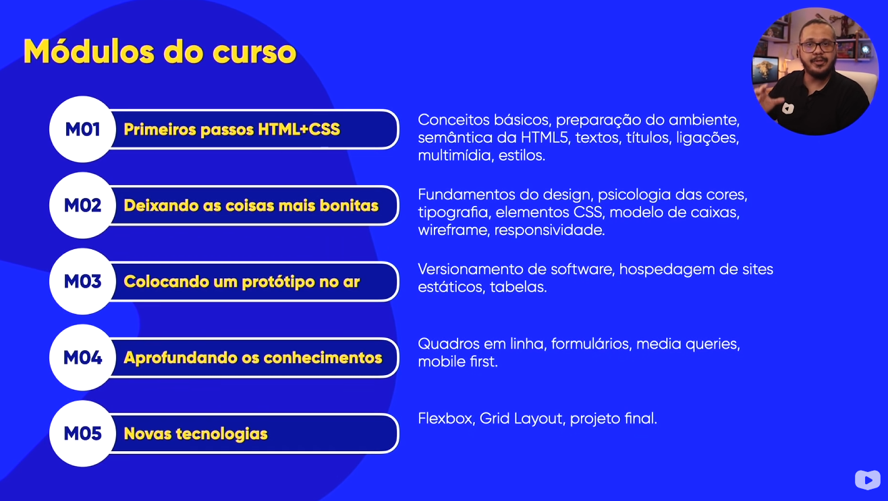

---

#### Aula 02 – Será que este curso é para mim?

Nesta aula, o professor discute a relevância de um curso online e se ele é adequado para diferentes pessoas. Ele menciona a dúvida comum sobre se vale a pena fazer o curso e se ele é adequado para os alunos. O professor destaca que o curso aborda o ensino de HTML e CSS, além de enfatizar a importância da prática e dos exercícios. O professor lista alguns critérios para determinar se o curso é adequado para o aluno, como o interesse em aprender a criar sites, a vontade de aprofundar conhecimentos em especificações como flexbox e grid layout, a capacidade de adaptar códigos prontos e a necessidade de aprender a colocar os sites online. Por fim, o professor menciona que o curso pode não ser adequado para aqueles que já possuem conhecimentos avançados em HTML e CSS, que procuram apenas por códigos prontos ou templates, ou que já dominam projetos de clone.

**É pra você**

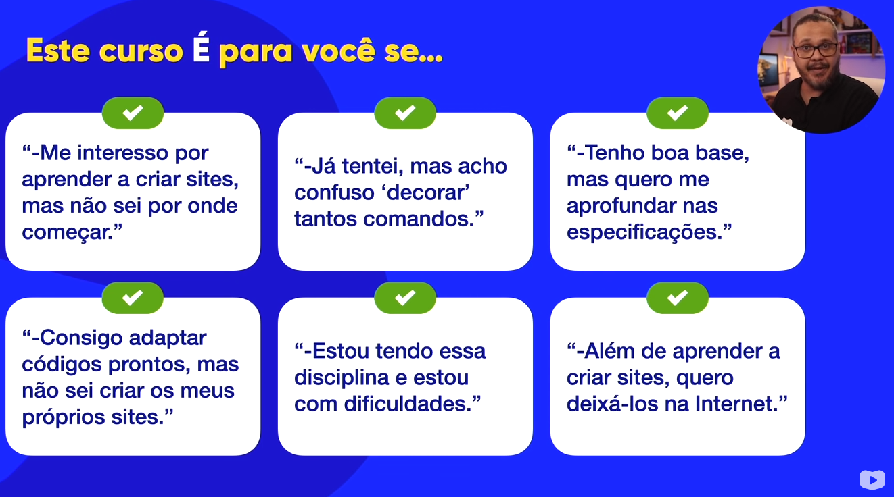

**Não é pra você**

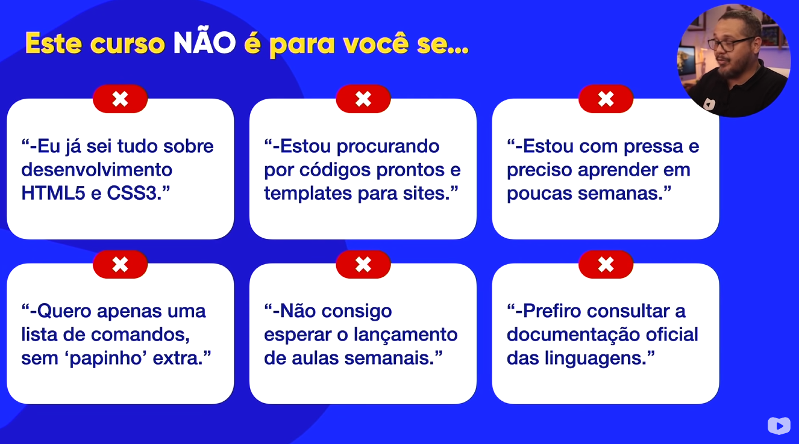

---

#### Aula 03 – Melhores livros para aprender HTML5 e CSS3

Nesta aula, o professor fala sobre a importância de ter bibliografia e materiais de apoio para o curso de HTML e CSS. Ele menciona que o curso em vídeo fornece materiais gratuitos, como PDFs de apoio, e recomenda que os alunos utilizem esses recursos para complementar o aprendizado. Além disso, o professor menciona algumas referências online gratuitas, como a Mozilla Developer Network, W3C, Web Hypertext Application Technology Working Group e W3Schools. Ele também menciona a opção de usar livros físicos ou leitores de livros eletrônicos, e recomenda alguns títulos, como "HTML Up and Running" de Mario and Cia Del Rey.

Referência Online

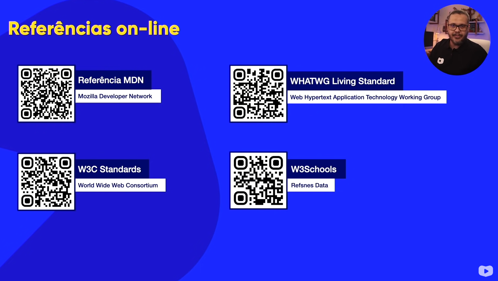

Livros

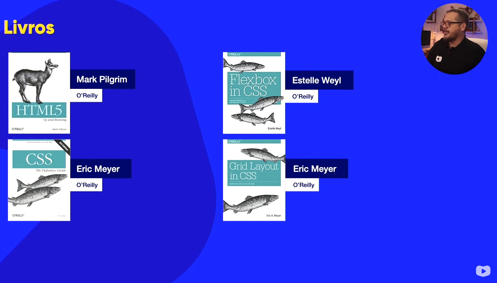

---

#### Aula 04 – Como a Internet chega na minha casa?

Nesta aula, o professor fala sobre a origem da internet durante a Guerra Fria. Destaca-se que a Arpanet, uma rede inicial de computadores, foi criada para estabelecer comunicação e compartilhamento de informações entre diferentes pontos. Para solucionar o desafio de linguagens de computadores diferentes, foi desenvolvido o protocolo NCP (Network Control Protocol) para permitir a comunicação entre os sistemas. Posteriormente, dois pesquisadores, Bobby Khan e Vinton Cerf, criaram protocolos complementares chamados TCP (Transfer Control Protocol) e IP (Internet Protocol), respectivamente. Esses protocolos foram unificados para formar o conjunto de protocolos TCP/IP, que é amplamente usado até hoje. A evolução da internet possibilitou a comunicação entre continentes, e a Arpanet foi dividida em redes separadas para militares (Milnet) e instituições científicas (NSFNET). É mencionado o termo "WWW" (World Wide Web) e o protocolo HTTP (Hypertext Transfer Protocol). Essa combinação de tecnologias permitiu o acesso fácil e o compartilhamento de informações na forma de páginas da web. A internet continuou a crescer e se desenvolver desde então.

---

### Capítulo 02

---

#### Aula 01 – Como a Internet funciona?

Nesta aula, o professor menciona alguns conceitos sobre como a internet funciona. Ele aborda temas como a representação dos dados no computador, explicando o que são bits e bytes, os múltiplos do byte e como os dados são representados em sequências de 0 e 1 na linguagem binária. Além disso, fala sobre a conexão à internet, o uso de modems e a comunicação com servidores. Também menciona a descoberta do endereço IP próprio e de um site, a função dos servidores DNS e o funcionamento geral da internet, incluindo as rotas utilizadas.

Dados em armazenagem

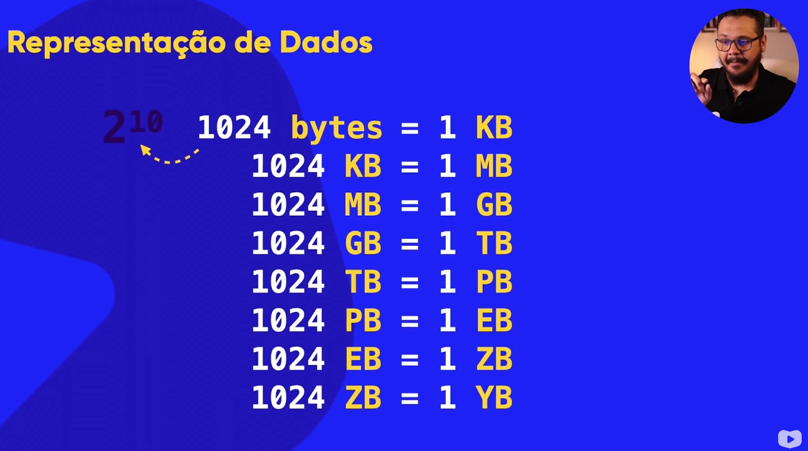

Modem

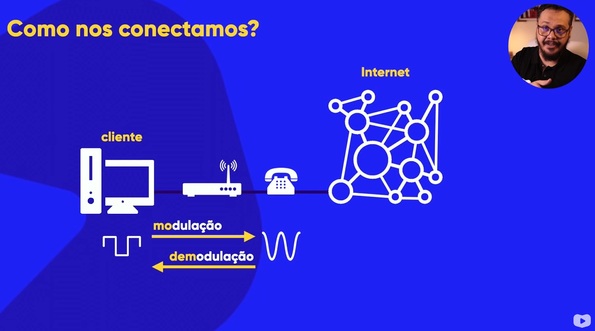

Servidores

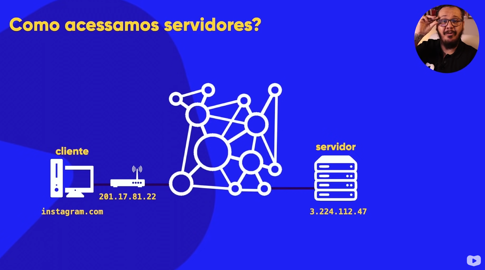

---

#### Aula 02 – O que é domínio e hospedagem?

O professor fala sobre o funcionamento da internet e como os sites são acessados por outras pessoas. Ele explica três situações: a primeira é quando um site está hospedado em um servidor e pode ser acessado digitando o endereço (URL); a segunda é quando o site está armazenado no próprio computador e não pode ser acessado por outros dispositivos; e a terceira é quando o site está em outro computador e também não pode ser acessado por outros dispositivos. O professor destaca a importância de ter um domínio, que é o nome único do site, e de ter uma hospedagem, que é o local onde os arquivos do site são armazenados. Ele menciona que o domínio pode ser gratuito ou pago, e que a hospedagem pode ser gratuita ou paga, dependendo das necessidades e recursos do site.

Dominio e hospedagem


---

### Capítulo 03

---

#### Aula 01 - A diferença entre HTML, CSS e JavaScript

Neste vídeo, o professor fala sobre HTML, CSS e JavaScript, que são as três tecnologias fundamentais para a criação de sites. Ele explica que o HTML é uma linguagem de marcação voltada para o conteúdo, enquanto o CSS é responsável pelo design e as folhas de estilo em cascata. O JavaScript, por sua vez, é uma linguagem de programação utilizada para adicionar interatividade aos sites. O professor menciona a importância de aprender as três tecnologias juntas e mostra um plugin para desabilitar o JavaScript em um site como exemplo.

Exemplo das tecnologias em um site:

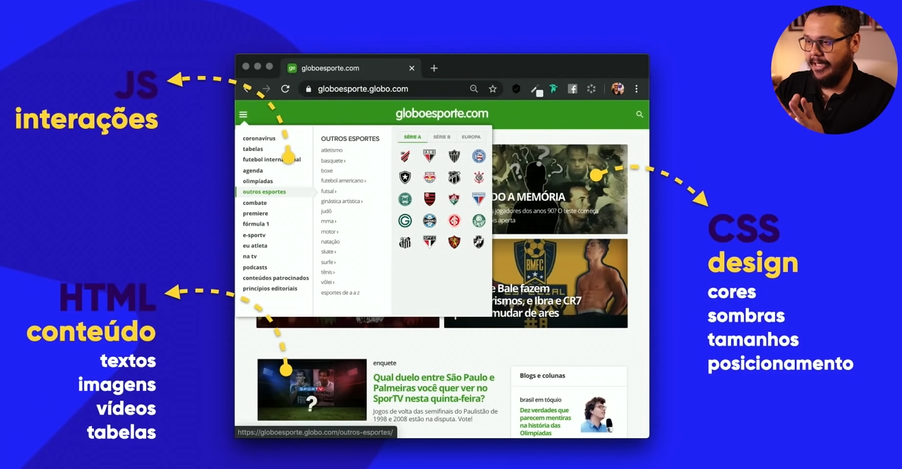

Exemplo de Tags HTML e suas estruturas:


Exemplo de Tag CSS e sua estrutura:

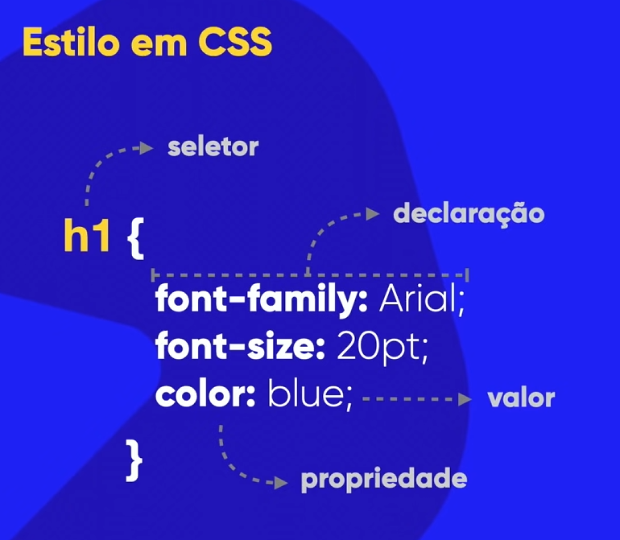

Exemplo da estrutura do documento HTML:


---

#### Aula 02 - Front-end, Back-end e Full stack

Neste vídeo, o professor fala sobre os termos "front-end", "back-end", "client-side" e "server-side". Ele explica que front-end refere-se ao desenvolvimento visual e interativo de um site, utilizando tecnologias como HTML, CSS e JavaScript. O back-end está relacionado à interação do código com o servidor, utilizando linguagens como PHP, JavaScript, C#, Python, Ruby, entre outras. O termo client-side é usado para se referir às tecnologias que rodam no navegador do cliente e server-side para tecnologias que rodam no servidor. O professor também destaca a diferença entre front-end e designer, explicando que o designer é responsável pela parte visual e o front-end adapta o design utilizando as tecnologias adequadas.

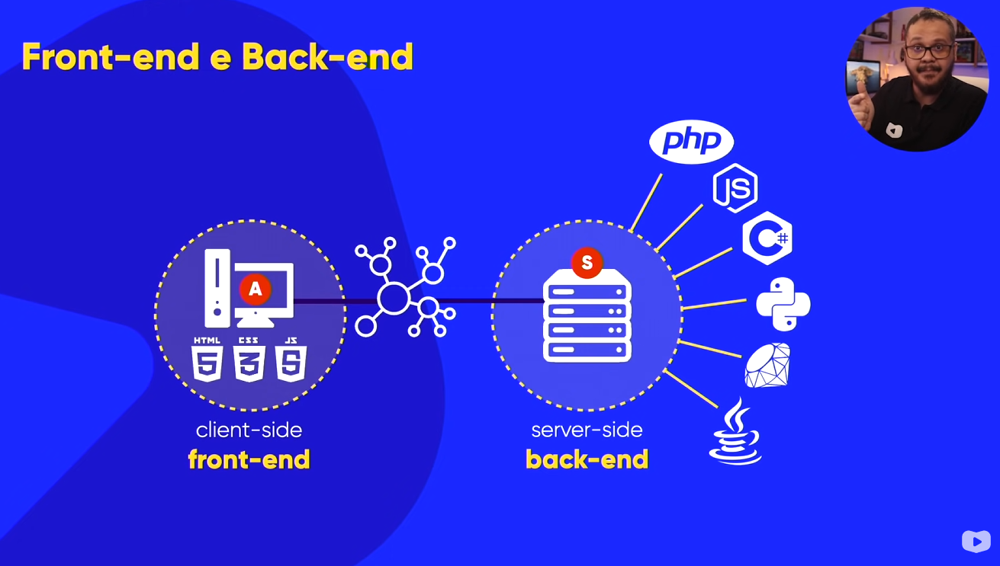

---

### Capítulo 04

---

#### Aula 01 - Instalando todas as ferramentas

Neste vídeo, o professor dá instruções sobre a instalação do Google Chrome e do Visual Studio Code em um computador. Ele menciona que é importante baixar os programas apenas dos sites oficiais. O professor também destaca que o Google Chrome é um navegador gratuito e de qualidade, e o Visual Studio Code é um editor de código gratuito da Microsoft. O vídeo também menciona a opção de configurar o Visual Studio Code em português e fazer algumas personalizações, como aumentar o tamanho da fonte. Além disso, o professor menciona a opção de salvar automaticamente os arquivos no Visual Studio Code.

- [Google Chrome](https://www.google.com/intl/pt-BR/chrome/)

- [Visual Studio Code](https://code.visualstudio.com/)

---

#### Aula 02 - Seu primeiro código HTML

Neste vídeo, aprendemos a criar um documento html, editá-lo e abrir em um navegador. 

Usamos as tags abaixo:

```html
<title></title> <!-- Título da página -->
<h1></h1>       <!-- Título de cabeçalho nível 1 -->
<p></p>         <!-- Parágrafo -->
<hr>            <!-- Quebra temática entre elementos / linha horizontal -->
```

Nesta aula criamos o exercício [ex001](Exerc%C3%ADcios%20e%20Desafios/ex001/index.html)

---

### Capítulo 05

---

#### Aula 01 - Parágrafos e Quebras

Aprendemos a quebrar linhas no meio de parágrafos.

Usamos as tags abaixo:

```html
<br> <!-- Quebra de linha -->
```

Nesta aula criamos o exercício [ex002](Exerc%C3%ADcios%20e%20Desafios/ex002/index.html).

---

#### Aula 02 - Símbolos e Emoji no seu site

Aprendemos que a tag br não deve ser usada em excesso e que espaçamento será ensinado em CSS para fazer da maneira correta. Também foi ensinado a criar símbolos especiais e emojis utilizando html.

Site usado no vídeo [Emojipedia](https://emojipedia.org/) para buscar emojis.

Usamos nesta aula o exercício [ex002](Exerc%C3%ADcios%20e%20Desafios/ex002/index.html) para editá-lo.

---

### Capítulo 06

---

#### Aula 01 - Você tem o direito de usar qualquer imagem no seu site?

Nesta aula, o professor aborda a importância de compreender os direitos autorais ao utilizar imagens em um site. Ele destaca que copiar imagens da internet e utilizá-las como se fossem suas não é correto legalmente, mesmo que muitas pessoas pensem o contrário. O professor menciona a necessidade de agir profissionalmente e respeitar os direitos autorais ao construir sites para clientes. Ele ensina como refinar as buscas no Google Imagens para encontrar imagens que possam ser utilizadas corretamente, mencionando opções de licença e sugerindo sites como Unsplash e Pexels, que oferecem imagens gratuitas com licenças adequadas.

Site usado no vídeo [Unsplash](https://unsplash.com/pt-br) para buscar imagens com licença de uso.

Site usado no vídeo [Pexels](https://www.pexels.com/pt-br/) para buscar imagens com licença de uso.

Site usado no vídeo [GIMP](https://www.gimp.org/) para edição de imagens.

---

#### Aula 02 - Quais são os formatos para imagens na Web?

Nesta aula, o professor fala sobre a instalação de uma ferramenta chamada GIMP e em seguida aborda os formatos de imagem mais comuns para uso na web, como JPEG e PNG. Ele explica que o formato JPEG comprime as imagens, eliminando repetições de pixels, enquanto o PNG preserva melhor a qualidade, mas pode gerar arquivos maiores. O professor ressalta que a escolha do formato depende das necessidades e preferências individuais.

---

#### Aula 03 - O tamanho das imagens importa para um site?

Nesta aula, o professor fala sobre a diferença entre os formatos de imagem JPEG e PNG e explica que o tamanho das imagens é um assunto importante ao adicionar imagens em um site. Ele menciona a necessidade de gerar diferentes tamanhos de imagem para otimização e descreve como redimensionar uma imagem usando a ferramenta GIMP. O professor ensina a compactar imagens e dâ enfâse na importância no tamanho em bytes das imagens para não deixar o site que está criando muito lento ou com consumo alto de dados.

---

#### Aula 04 - A tag img em HTML5

Nesta aula, o professor fala sobre a adição de imagens em um site usando a tag ```  ```. Ele menciona a importância de entender os direitos autorais, formatos e tamanhos de imagem, e destaca a necessidade de conhecer esses conceitos antes de trabalhar com imagens em um site. Em seguida, ele demonstra como adicionar uma imagem ao site, explica a importância de incluir um texto alternativo para acessibilidade e formas diferentes de adicionar a imagem através de uma URL, a imagem dentro da pasta onde está o documento HTML e em outra pasta qualquer.

Usamos a tag abaixo:

```html
 <!-- Acrescentando uma imagem ao site -->
```

Nesta aula criamos o exercício [ex003](Exerc%C3%ADcios%20e%20Desafios/ex003/index.html).

---

#### Aula 05 - Como mudar o favicon de um site

Neste vídeo, o professor explica que os ícones de favoritos são aqueles pequenos ícones exibidos na guia do navegador ao abrir um site. O professor menciona a importância de ter um ícone de favorito para o site e mostra algumas formas de criar um ícone. Ele sugere usar uma imagem simples e de baixa complexidade para criar o ícone e oferece dicas sobre onde encontrar imagens gratuitas para usar como ícone de favorito. O professor também menciona um site onde é possível desenhar o próprio ícone de favorito entre outros.

Usamos a tag abaixo:

```html
<link rel="Define a relação entre um recurso vinculado em href" href="Caminho do favicon" type="Especifica o formato de tipo MIME do item que está sendo vinculado"> <!-- Acrescentando um favicon ao site -->
```

Site usado para consultar info sobre favicon [bitsofcode](https://bitsofco.de/all-about-favicons-and-touch-icons/).

Site usado no vídeo [Icon Archive](https://www.iconarchive.com/) para buscar ícones/favicons.

Site usado no vídeo [favicon.cc](https://www.favicon.cc/) para criar ícones/favicons.

Site usado no vídeo [favicon.io](https://favicon.io/) para transformar texto, imagem, emoji em ícones/favicons.

Nesta aula criamos o exercício [ex004](Exerc%C3%ADcios%20e%20Desafios/ex004/index.html).

---

### Capítulo 07

---

#### Aula 01 - Hierarquia de Títulos

Neste vídeo, o professor fala sobre hierarquia de títulos em HTML5. Ele explica que os títulos em HTML têm níveis, representados pelos números de 1 a 6. O professor utiliza exemplos de revistas e índices de livros para ilustrar a hierarquia dos títulos. Ele mostra como os títulos principais estão no nível 1, os subtítulos estão em níveis mais baixos (2, 3, 4, etc.) e como isso é importante para a estrutura e organização do conteúdo. Em seguida, o professor mostra um exercício prático em que deve-se criar um arquivo HTML e utilizar os diferentes níveis de títulos.

Usamos as tags abaixo:

```html
<h2></h2>   <!-- Título de cabeçalho nível 2 -->
<h3></h3>   <!-- Título de cabeçalho nível 3 -->
<h4></h4>   <!-- Título de cabeçalho nível 4 -->
Lorem       <!-- Usado para criar texto aleatório -->
```

Nesta aula criamos o exercício [ex006](Exerc%C3%ADcios%20e%20Desafios/ex006/index.html).

---

### Capítulo 08

---

#### Aula 01 - Semântica na HTML5 é importante

O vídeo aborda a importância da semântica no HTML5, explicando que se trata do significado das tags utilizadas. São mencionadas algumas diferenças entre o HTML4 e o HTML5, como o uso de tags obsoletas no HTML4 e a necessidade de estar atualizado nas especificações do HTML. O professor oferece um exemplo prático de criação de um arquivo HTML4 e destaca a importância de evitar o uso de tags obsoletas e estar atento às mudanças no HTML5. Por fim, é mencionada a importância de utilizar tags semânticas e demonstrado como alterar a cor de fundo usando CSS3.

Site usado no vídeo [W3C](https://www.w3.org/TR/2010/WD-html5-20100304/obsolete.html) para verificar tags obsoletas.

Usamos as tags abaixo:


```html
    <style></style>     <!-- Contém informações de estilo para um documento ou uma parte do documento. -->
    <address></address> <!-- Fornece informações de contato como endereço físico, URL, email, telefone, mídia social, coordenadas geográficas, por aí vai. -->
```

```css
    body {                      /* seletor html para ser declarado */
        background-color: blue; /* propriedade de cor de fundo : valor da propriedade */
    }
```

Nesta aula criamos o exercício [ex007](Exerc%C3%ADcios%20e%20Desafios/ex007/index.html).

---

#### Aula 02 - Negrito e Itálico do jeito certo

Neste vídeo, o professor continua os estudos sobre formatação de textos em HTML5. Ele destaca a importância do conceito de semântica no HTML5 e apresenta diferentes formas de formatação, incluindo negrito e itálico. São mencionadas tanto as tags não semânticas quanto as tags semânticas para enfatizar palavras ou frases específicas.

Nesta aula criamos o exercício [ex008](Exerc%C3%ADcios%20e%20Desafios/ex008/index.html).

Usamos as tags abaixo:

```html
    <b></b>             <!-- Negrito sem semântica -->
    <strong></strong>   <!-- Negrito de forma semântica -->
    <i></i>             <!-- Itálico sem semântica -->
    <em></em>           <!-- Ênfase de forma semântica -->
```

---

#### Aula 03 - Formatações adicionais em HTML

Neste vídeo, o professor continua falando sobre formatação de textos em HTML e CSS. Ele destaca a tag ```<mark>``` como uma forma de destacar texto, como um marcador de texto. Ele também menciona a importância de aprender CSS para fazer formatações mais avançadas. Ele também explica como alterar a cor do marcador usando CSS. O professor menciona que existem outras formas de estilizar o texto de forma semântica como algumas das tags abaixo.

Usamos as tags abaixo:

```html
    <mark></mark>   <!-- Texto marcado -->
    <big></big>     <!-- Texto grande / tag obsoleta -->
    <small></small> <!-- Texto pequeno -->
    <del></del>     <!-- Texto deletado -->
    <ins></ins>     <!-- Texto inserido/sublinhado semântico -->
    <u></u>         <!-- Texto sublinhado não semântico -->
    <sup></sup>     <!-- Texto sobrescrito -->
    <sub></sub>     <!-- Texto subscrito -->
```

Usamos nesta aula o exercício [ex008](Exerc%C3%ADcios%20e%20Desafios/ex008/index.html) para editá-lo.

---

#### Aula 04 - Citações e Códigos

Nesta última parte do Capítulo 8, o professor aborda a formatação de código-fonte, abreviações e citações. Ele demonstra como envelopar trechos de código usando a tag ```<code>``` e preservar a formatação com a tag ```<pre>```. O professor mostra exemplos de outras tags e ressalta a importância da organização e indentação do código.

Nesta aula criamos o exercício [ex008b](Exerc%C3%ADcios%20e%20Desafios/ex008b/index.html).

Usamos as tags abaixo:

```html
    <code></code>               <!-- Exibe seu conteúdo estilizado de forma a indicar que o texto é um pequeno fragmento de código de computador. -->
    <pre></pre>                 <!-- Tag utilizada para representar texto pré-formatado. -->
    <q></q>                     <!-- Indica que o texto dentro da tag é uma pequena citação. -->
    <blockquote></blockquote>   <!-- Indica que o texto incluído é uma longa citação. -->
    <abbr></abbr>               <!-- Representa uma abreviação ou acrônimo. -->
    <bdo></bdo>                 <!-- É usado para substituir a direcionalidade atual do texto. -->
```

---

### Capítulo 09

---

#### Aula 01 - Lista OL e UL

Nesta parte do curso, o professor inicia o estudo sobre listas em HTML. Ele explica que as listas são amplamente utilizadas e introduz os três tipos de listas suportadas pelo HTML: listas ordenadas e listas não ordenadas. O professor mostra como trabalhar com listas ordenadas, utilizando as tags ```<ol>``` e ```<ul>``` e dentro das respectivas tags os itens de lista ```<li>```.

Usamos as tags abaixo:

```html
    <ol></ol>   <!-- Representa uma lista de itens ordenados. -->
    <ul></ul>   <!-- Representa uma lista de itens não ordenados. -->
    <li></li>   <!-- Representa um item que faz parte de uma lista. -->
```

Nesta aula criamos o exercício [ex009](Exerc%C3%ADcios%20e%20Desafios/ex009/index.html).

---

#### Aula 02 - Listas mistas e de definição

Neste vídeo, o professor aborda listas mistas e listas de definição. Ele inicia explicando como misturar listas ordenadas e não ordenadas, criando sub-listas dentro de outras. Em seguida, demonstra como criar listas de definição, onde se tem um termo e sua definição correspondente. Essa lista é como um dicionário, onde o termo fica à esquerda e a definição, um pouco mais recuada para a direita.
Essas listas podem ser úteis para criar menus e são personalizáveis com CSS.

Usamos as tags abaixo:

```html
    <dl></dl>  <!-- Lista de definição para englobar uma lista de pares de termos e descrições -->
    <dt></dt>  <!-- Definição de termo, identifica um termo na lista de definição -->
    <dd></dd>  <!-- Fornece detalhes ou uma definição mais completa do termo precedente definido por dt -->
```

Usamos nesta aula o exercício [ex009](Exerc%C3%ADcios%20e%20Desafios/ex009/index.html) para editá-lo.

---

### Capítulo 10

---

#### Aula 01 - Links e Âncoras em HTML5

Nesta aula, o professor fala sobre a importância dos links na web, explicando que eles são fundamentais para a navegação entre páginas e sites. Os links são como âncoras clicáveis que levam o usuário de um lugar para outro na internet. O professor menciona a relevância dos links externos, que apontam para outros sites, e sugere usar o atributo "target" com "blank" para abrir esses links em uma nova aba, mantendo o site original acessível. O texto também menciona a criação de links internos. O foco principal é ensinar sobre links na web e sua importância para a navegação.

Nesta aula criamos o exercício [ex010](Exerc%C3%ADcios%20e%20Desafios/ex010/index.html).

---

#### Aula 02 - Links Internos

Nesta aula, o professor fala sobre links internos e como criar ligações entre páginas em um site. Ele menciona que um link interno é uma ligação que conecta uma página a outra dentro do mesmo servidor. Primeiro, ele mostra como criar um link interno para a segunda página, e também como adicionar um link de volta para a primeira página. Em seguida, ele cria uma terceira página dentro de uma pasta separada e explica como criar um link interno para essa página, incluindo o caminho para acessá-la dentro da pasta. O professor também menciona a possibilidade de usar o atributo "target" para abrir links em uma nova aba ou na mesma página. Além disso, ele explica a opção "nofollow" para links patrocinados ou quando não deseja dar um aval ao conteúdo do link.

Usamos nesta aula o exercício [ex010](Exerc%C3%ADcios%20e%20Desafios/ex010/index.html) para editá-lo.

Usamos as tags abaixo:

```html
    <a href="local/endereço">Texto do link</a>  <!-- O elemento a (ou elemento âncora), com o atributo href cria-se um hiperligação nas páginas web, arquivos, endereços de emails, ligações na mesma página ou endereços na URL -->
    
```

---

#### Aula 03 - Links para download

Nesta aula, você aprenderá a criar links para efetuar o download de arquivos. Para isso, o vídeo demonstra como criar links para download de um arquivo PDF e de um arquivo ZIP. Primeiro, é mostrado como criar o link para o arquivo PDF, com a opção de fazer o download diretamente ou abrir o arquivo no navegador. Em seguida, é explicado como fazer o download do arquivo ZIP, utilizando a tag "a" e definindo o tipo de arquivo. O vídeo também menciona a possibilidade de compactar o arquivo ZIP para facilitar o download.

Os desafios propostos no Capítulo 10 envolvem criar links para diferentes tipos de arquivos e realizar ações específicas, como fazer o download de imagens e PDFs, e criar links internos e externos.

Usamos nesta aula o exercício [ex010](Exerc%C3%ADcios%20e%20Desafios/ex010/index.html) para editá-lo.

---

#### Aula 04 - Desafios propostos

Nesta aula, o professor apresenta os desafios do Capítulo 10 do curso de HTML e CSS.

Os desafios propostos são o Desafio 5 e o Desafio 6. No Desafio 5, devemos criar uma página com as redes sociais do professor o sua mesmo, incluindo uma foto, descrição e links para seus perfis no YouTube, Instagram, LinkedIn, Twitter e Facebook. Os links devem abrir em novas abas.

Já no Desafio 6, é pedido que os alunos criem uma lista com vários elementos diferentes, como parágrafo, títulos (H1-H6), imagens, abreviações, código-fonte e com marcadores. Ao passar o mouse sobre os elementos, deve aparecer uma caixa com informações adicionais.

---

### Capítulo 11

---

#### Aula 01 - Imagens Dinâmicas

---

#### Aula 02 - Imagens que se adaptam sozinhas

---

#### Aula 03 - Colocando áudio no seu site

---

#### Aula 04 - Formatos de vídeo para seu site

---

#### Aula 05 - Vídeos em hospedagem própria

---

#### Aula 06 - Incorporação de vídeos externos

---

#### Aula 07 - Desafio:um site com vídeos

---

### Capítulo 12

---

#### Aula 01 - Estilos CSS inline

---

#### Aula 02 - Estilos CSS internos

---

#### Aula 03 - Estilos CSS externos

---

## Módulo 02

---

### Capítulo 13

---

#### Aula 00 - O que vamos aprender no módulo 02?

---

#### Aula 01 - Psicologia das Cores

---

#### Aula 02 - Representando Cores com CSS3

---

#### Aula 03 - Harmonia de cores

---

#### Aula 04 - Paleta de cores

---

#### Aula 05 - Como capturar cores da tela?

---

#### Aula 06 - Como criar degradê com CSS ?

---

#### Aula 07 - Criando um exemplo real

---

### Capítulo 14

---

#### Aula 01 - Primeiros passos em Tipografia

---

#### Aula 02 - Anatomia do tipo

---

#### Aula 03 - Famílias de fonte com CSS

---

#### Aula 04 - Tamanho de fonte e suas medidas

---

#### Aula 05 - Peso, estilo e shorthand font

---

#### Aula 06 - Usando Google Fonts

---

#### Aula 07 - Usando fontes externas baixadas

---

#### Aula 08 - Capturando as fontes usadas em um site

---

#### Aula 09 - Detectando fontes dentro de imagens

---

#### Aula 10 - Alinhamento de textos com CSS

---

### Capítulo 15

---

#### Aula 01 - Usando o id com CSS

---

#### Aula 02 - As diferenças entre id e class

---

#### Aula 03 - Pseudo-classes em CSS

---

#### Aula 04 - Pseudo-elementos em CSS

---

### Capítulo 16

---

#### Aula 01 - Modelo de Caixas: primeiros passos

---

#### Aula 02 - Modelo de Caixas na prática (pt.1)

---

#### Aula 03 - Modelo de Caixas na prática (pt.2)

---

#### Aula 04 - Grouping Tags em HTML5

---

#### Aula 05 - Sombra nas Caixas

---

#### Aula 06 - Caixas com vértices arredondados

---

#### Aula 07 - Bordas decoradas

---

#### Aula 08 - DESAFIO do Módulo 02

---

### Capítulo 17

---

#### Aula 01 - Criando um projeto a partir do zero

---

#### Aula 02 - Navegando pelo projeto pronto

---

#### Aula 03 - Planejando a estrutura do seu site

---

#### Aula 04 - Transformando o layout em código

---

#### Aula 05 - Organizando o conteúdo do site

---

#### Aula 06 - Variáveis em CSS

---

#### Aula 07 - Responsividade para sites

---

#### Aula 08 - Responsividade na prática

---

#### Aula 09 - Configurando o header e o menu do site

---

#### Aula 10 - Melhorando o formato do conteúdo

---

#### Aula 11 - Rodapé, conteúdo periférico e links

---

#### Aula 12 - Tornando um vídeo responsivo

---

## Módulo 03

---

### Capítulo 18

---

#### Aula 00 - O que vamos aprender no módulo 03?

---

#### Aula 01 - O que é Git e GitHub?

---

#### Aula 02 - Instalando Git e GitHub no PC

---

#### Aula 03 - Criando conta no GitHub

---

#### Aula 04 - Primeiro repositório git e GitHub

---

#### Aula 05 - Gerenciando Repositóris GitHub

---

#### Aula 06 - Hospedando site gratuitamente com GitHub Pages

---

#### Aula 07 - Manutenção em sites hospedados no GitHub Pages

---

#### Aula 08 - Recursos Sociais do GitHub

---

#### Aula 09 - Clonando Repositórios GitHub

---

#### Aula 10 - GitHub em vários PCs

---

### Capítulo 19

---

#### Aula 01 - Download das imagens do capítulo

---

#### Aula 02 - Colocando uma imagem de fundo no seu site

---

#### Aula 03 - Imagens que se repetem no fundo do site

---
 
