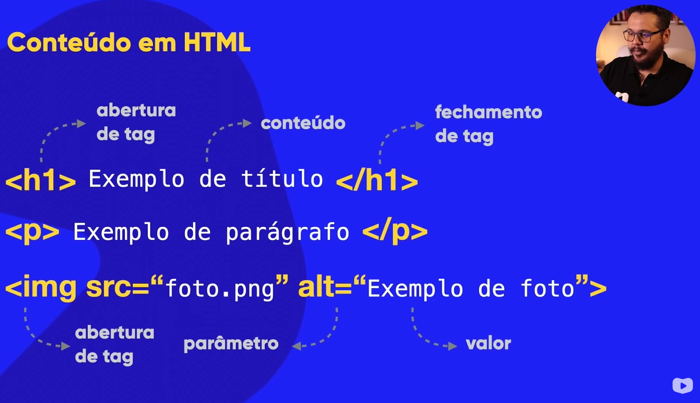
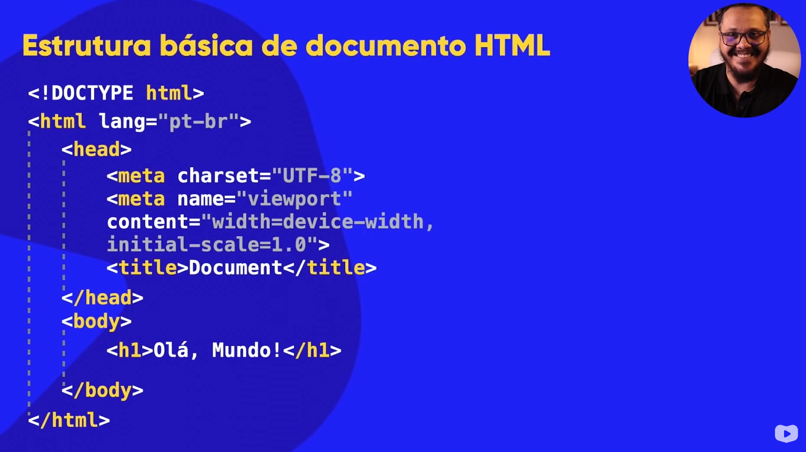

# Curso HTML5 e CSS3

Curso de HTML5 e CSS3 - CursoemVideo(Gustavo Guanabara)

---

## Módulo 01

---

### Capítulo 01

---

#### Aula 00 - O que vamos aprender no módulo 01?

Nesta aula vimos tudo oque vamos aprender no curso de HTML e CSS, este curso está dividido em vários módulos. O primeiro módulo é chamado "Primeiros Passos" e abrange os capítulos de 1 a 12. Teremos cinco módulos, 30 capítulos e mais de 200 vídeos. O primeiro módulo aborda a evolução da internet, a diferença entre domínio e hospedagem, front-end e back-end, e as linguagens HTML, CSS e JavaScript. Também ira ensinar a configurar o ambiente de desenvolvimento, instalar o Visual Studio Code e o Google Chrome, e fala sobre bibliografia recomendada. No decorrer do módulo, seram ensinados conceitos básicos de HTML5, como a estrutura básica de um documento, formatação de texto, hierarquia de títulos, links, imagens, áudio e vídeo. O módulo também introduz a aplicação de estilos usando CSS e diferencia HTML5 e CSS3.

---

#### Aula 01 – Precisamos fazer um acordo

Nesta aula, o professor menciona a importância de um acordo imaginário para aprender HTML e CSS. Ele destaca a importância dos módulos do curso. O primeiro módulo aborda os conceitos básicos de HTML e CSS, enquanto o segundo explora o design e a estética. O terceiro módulo abrange a prototipação e a hospedagem de sites, enquanto o quarto se aprofunda nos conhecimentos. O último módulo aborda as novas tecnologias em CSS e HTML. O professor destaca a necessidade de um computador e acesso à internet, além de enfatizar a importância do foco, exercícios e anotações para o aprendizado.

Módulos do Curso:


---

#### Aula 02 – Será que este curso é para mim?

Nesta aula, o professor discute a relevância de um curso online e se ele é adequado para diferentes pessoas. Ele menciona a dúvida comum sobre se vale a pena fazer o curso e se ele é adequado para os alunos. O professor destaca que o curso aborda o ensino de HTML e CSS, além de enfatizar a importância da prática e dos exercícios. O professor lista alguns critérios para determinar se o curso é adequado para o aluno, como o interesse em aprender a criar sites, a vontade de aprofundar conhecimentos em especificações como flexbox e grid layout, a capacidade de adaptar códigos prontos e a necessidade de aprender a colocar os sites online. Por fim, o professor menciona que o curso pode não ser adequado para aqueles que já possuem conhecimentos avançados em HTML e CSS, que procuram apenas por códigos prontos ou templates, ou que já dominam projetos de clone.

**É pra você**


**Não é pra você**


---

#### Aula 03 – Melhores livros para aprender HTML5 e CSS3

Nesta aula, o professor fala sobre a importância de ter bibliografia e materiais de apoio para o curso de HTML e CSS. Ele menciona que o curso em vídeo fornece materiais gratuitos, como PDFs de apoio, e recomenda que os alunos utilizem esses recursos para complementar o aprendizado. Além disso, o professor menciona algumas referências online gratuitas, como a Mozilla Developer Network, W3C, Web Hypertext Application Technology Working Group e W3Schools. Ele também menciona a opção de usar livros físicos ou leitores de livros eletrônicos, e recomenda alguns títulos, como "HTML Up and Running" de Mario and Cia Del Rey.

Referência Online


Livros


---

#### Aula 04 – Como a Internet chega na minha casa?

Nesta aula, o professor fala sobre a origem da internet durante a Guerra Fria. Destaca-se que a Arpanet, uma rede inicial de computadores, foi criada para estabelecer comunicação e compartilhamento de informações entre diferentes pontos. Para solucionar o desafio de linguagens de computadores diferentes, foi desenvolvido o protocolo NCP (Network Control Protocol) para permitir a comunicação entre os sistemas. Posteriormente, dois pesquisadores, Bobby Khan e Vinton Cerf, criaram protocolos complementares chamados TCP (Transfer Control Protocol) e IP (Internet Protocol), respectivamente. Esses protocolos foram unificados para formar o conjunto de protocolos TCP/IP, que é amplamente usado até hoje. A evolução da internet possibilitou a comunicação entre continentes, e a Arpanet foi dividida em redes separadas para militares (Milnet) e instituições científicas (NSFNET). É mencionado o termo "WWW" (World Wide Web) e o protocolo HTTP (Hypertext Transfer Protocol). Essa combinação de tecnologias permitiu o acesso fácil e o compartilhamento de informações na forma de páginas da web. A internet continuou a crescer e se desenvolver desde então.

---

### Capítulo 02

---

#### Aula 01 – Como a Internet funciona?

Nesta aula, o professor menciona alguns conceitos sobre como a internet funciona. Ele aborda temas como a representação dos dados no computador, explicando o que são bits e bytes, os múltiplos do byte e como os dados são representados em sequências de 0 e 1 na linguagem binária. Além disso, fala sobre a conexão à internet, o uso de modems e a comunicação com servidores. Também menciona a descoberta do endereço IP próprio e de um site, a função dos servidores DNS e o funcionamento geral da internet, incluindo as rotas utilizadas.

Dados em armazenagem


Modem


Servidores


---

#### Aula 02 – O que é domínio e hospedagem?

O professor fala sobre o funcionamento da internet e como os sites são acessados por outras pessoas. Ele explica três situações: a primeira é quando um site está hospedado em um servidor e pode ser acessado digitando o endereço (URL); a segunda é quando o site está armazenado no próprio computador e não pode ser acessado por outros dispositivos; e a terceira é quando o site está em outro computador e também não pode ser acessado por outros dispositivos. O professor destaca a importância de ter um domínio, que é o nome único do site, e de ter uma hospedagem, que é o local onde os arquivos do site são armazenados. Ele menciona que o domínio pode ser gratuito ou pago, e que a hospedagem pode ser gratuita ou paga, dependendo das necessidades e recursos do site.

Dominio e hospedagem


---

### Capítulo 03

---

#### Aula 01 - A diferença entre HTML, CSS e JavaScript

Neste vídeo, o professor fala sobre HTML, CSS e JavaScript, que são as três tecnologias fundamentais para a criação de sites. Ele explica que o HTML é uma linguagem de marcação voltada para o conteúdo, enquanto o CSS é responsável pelo design e as folhas de estilo em cascata. O JavaScript, por sua vez, é uma linguagem de programação utilizada para adicionar interatividade aos sites. O professor menciona a importância de aprender as três tecnologias juntas e mostra um plugin para desabilitar o JavaScript em um site como exemplo.

Exemplo das tecnologias em um site:


Exemplo de Tags HTML e suas estruturas:



Exemplo de Tag CSS e sua estrutura:


Exemplo da estrutura do documento HTML:



---

#### Aula 02 - Front-end, Back-end e Full stack

Neste vídeo, o professor fala sobre os termos "front-end", "back-end", "client-side" e "server-side". Ele explica que front-end refere-se ao desenvolvimento visual e interativo de um site, utilizando tecnologias como HTML, CSS e JavaScript. O back-end está relacionado à interação do código com o servidor, utilizando linguagens como PHP, JavaScript, C#, Python, Ruby, entre outras. O termo client-side é usado para se referir às tecnologias que rodam no navegador do cliente e server-side para tecnologias que rodam no servidor. O professor também destaca a diferença entre front-end e designer, explicando que o designer é responsável pela parte visual e o front-end adapta o design utilizando as tecnologias adequadas.


---

### Capítulo 04

---

#### Aula 01 - Instalando todas as ferramentas

Neste vídeo, o professor dá instruções sobre a instalação do Google Chrome e do Visual Studio Code em um computador. Ele menciona que é importante baixar os programas apenas dos sites oficiais. O professor também destaca que o Google Chrome é um navegador gratuito e de qualidade, e o Visual Studio Code é um editor de código gratuito da Microsoft. O vídeo também menciona a opção de configurar o Visual Studio Code em português e fazer algumas personalizações, como aumentar o tamanho da fonte. Além disso, o professor menciona a opção de salvar automaticamente os arquivos no Visual Studio Code.

- [Google Chrome](https://www.google.com/intl/pt-BR/chrome/)

- [Visual Studio Code](https://code.visualstudio.com/)

---

#### Aula 02 - Seu primeiro código HTML

Neste vídeo, aprendemos a criar um documento html, editá-lo e abrir em um navegador. 

Usamos as tags abaixo:

```html
<title></title> <!-- Título da página -->
<h1></h1> <!-- Título de cabeçalho nível 1 -->
<p></p> <!-- Parágrafo -->
<hr> <!-- Quebra temática entre elementos / linha horizontal -->
```

Nesta aula criamos o exercício [ex001](Exerc%C3%ADcios%20e%20Desafios/ex001/index.html)

---

### Capítulo 05

---

#### Aula 01 - Parágrafos e Quebras

Aprendemos a quebrar linhas no meio de parágrafos.

Usamos as tags abaixo:

```html
<br> <!-- Quebra de linha -->
```

Nesta aula criamos o exercício [ex002](Exerc%C3%ADcios%20e%20Desafios/ex002/index.html)

---

#### Aula 02 - Símbolos e Emoji no seu site

Aprendemos que a tag br não deve ser usada em excesso e que espaçamento será ensinado em CSS para fazer da maneira correta. Também foi ensinado a criar símbolos especiais e emojis utilizando html.

Site usado no vídeo [Emojipedia](https://emojipedia.org/)

Usamos nesta aula o exercício [ex002](Exerc%C3%ADcios%20e%20Desafios/ex002/index.html) para editá-lo.

---

### Capítulo 06

---

#### Aula 01 - Você tem o direito de usar qualquer imagem no seu site?

---

#### Aula 02 - Quais são os formatos para imagens na Web?

---

#### Aula 03 - O tamanho das imagens importa para um site?

---

#### Aula 04 - A tag img em HTML5

---

#### Aula 05 - Como mudar o favicon de um site

---

### Capítulo 07

---

#### Aula 01 - Hierarquia de Títulos

---

### Capítulo 08

---

#### Aula 01 - Semântica na HTML5 é importante

---

#### Aula 02 - Negrito e Itálico do jeito certo

---

#### Aula 03 - Formatações adicionais em HTML

---

#### Aula 04 - Citações e Códigos

---

### Capítulo 09

---

#### Aula 01 - Lista OL e UL

---

#### Aula 02 - Listas mistas e de definição

---

### Capítulo 10

---

#### Aula 01 - Links e Âncoras em HTML5

---

#### Aula 02 - Links Internos

---

#### Aula 03 - Links para download

---

#### Aula 04 - Desafios propostos

---

### Capítulo 11

---

#### Aula 01 - Imagens Dinâmicas

---

#### Aula 02 - Imagens que se adaptam sozinhas

---

#### Aula 03 - Colocando áudio no seu site

---

#### Aula 04 - Formatos de vídeo para seu site

---

#### Aula 05 - Vídeos em hospedagem própria

---

#### Aula 06 - Incorporação de vídeos externos

---

#### Aula 07 - Desafio:um site com vídeos

---

### Capítulo 12

---

#### Aula 01 - Estilos CSS inline

---

#### Aula 02 - Estilos CSS internos

---

#### Aula 03 - Estilos CSS externos

---

## Módulo 02

---

### Capítulo 13

---

#### Aula 00 - O que vamos aprender no módulo 02?

---

#### Aula 01 - Psicologia das Cores

---

#### Aula 02 - Representando Cores com CSS3

---

#### Aula 03 - Harmonia de cores

---

#### Aula 04 - Paleta de cores

---

#### Aula 05 - Como capturar cores da tela?

---

#### Aula 06 - Como criar degradê com CSS ?

---

#### Aula 07 - Criando um exemplo real

---

### Capítulo 14

---

#### Aula 01 - Primeiros passos em Tipografia

---

#### Aula 02 - Anatomia do tipo

---

#### Aula 03 - Famílias de fonte com CSS

---

#### Aula 04 - Tamanho de fonte e suas medidas

---

#### Aula 05 - Peso, estilo e shorthand font

---

#### Aula 06 - Usando Google Fonts

---

#### Aula 07 - Usando fontes externas baixadas

---

#### Aula 08 - Capturando as fontes usadas em um site

---

#### Aula 09 - Detectando fontes dentro de imagens

---

#### Aula 10 - Alinhamento de textos com CSS

---

### Capítulo 15

---

#### Aula 01 - Usando o id com CSS

---

#### Aula 02 - As diferenças entre id e class

---

#### Aula 03 - Pseudo-classes em CSS

---

#### Aula 04 - Pseudo-elementos em CSS

---

### Capítulo 16

---

#### Aula 01 - Modelo de Caixas: primeiros passos

---

#### Aula 02 - Modelo de Caixas na prática (pt.1)

---

#### Aula 03 - Modelo de Caixas na prática (pt.2)

---

#### Aula 04 - Grouping Tags em HTML5

---

#### Aula 05 - Sombra nas Caixas

---

#### Aula 06 - Caixas com vértices arredondados

---

#### Aula 07 - Bordas decoradas

---

#### Aula 08 - DESAFIO do Módulo 02

---

### Capítulo 17

---

#### Aula 01 - Criando um projeto a partir do zero

---

#### Aula 02 - Navegando pelo projeto pronto

---

#### Aula 03 - Planejando a estrutura do seu site

---

#### Aula 04 - Transformando o layout em código

---

#### Aula 05 - Organizando o conteúdo do site

---

#### Aula 06 - Variáveis em CSS

---

#### Aula 07 - Responsividade para sites

---

#### Aula 08 - Responsividade na prática

---

#### Aula 09 - Configurando o header e o menu do site

---

#### Aula 10 - Melhorando o formato do conteúdo

---

#### Aula 11 - Rodapé, conteúdo periférico e links

---

#### Aula 12 - Tornando um vídeo responsivo

---

## Módulo 03

---

### Capítulo 18

---

#### Aula 00 - O que vamos aprender no módulo 03?

---

#### Aula 01 - O que é Git e GitHub?

---

#### Aula 02 - Instalando Git e GitHub no PC

---

#### Aula 03 - Criando conta no GitHub

---

#### Aula 04 - Primeiro repositório git e GitHub

---

#### Aula 05 - Gerenciando Repositóris GitHub

---

#### Aula 06 - Hospedando site gratuitamente com GitHub Pages

---

#### Aula 07 - Manutenção em sites hospedados no GitHub Pages

---

#### Aula 08 - Recursos Sociais do GitHub

---

#### Aula 09 - Clonando Repositórios GitHub

---

#### Aula 10 - GitHub em vários PCs

---

### Capítulo 19

---

#### Aula 01 - Download das imagens do capítulo

---

#### Aula 02 - Colocando uma imagem de fundo no seu site

---

#### Aula 03 - Imagens que se repetem no fundo do site

---
 
